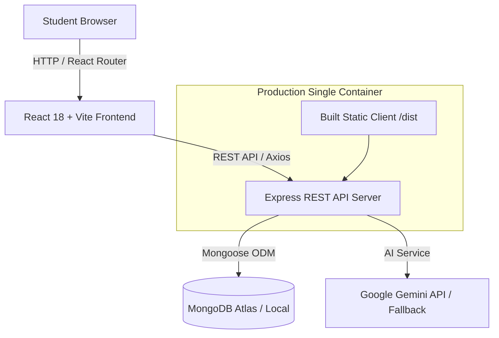

# 📦 BorrowBox - Campus Lending Platform

> **Borrow smarter. Share more.**

BorrowBox is a campus peer-to-peer item sharing and lending platform designed for college students. Students can easily browse available study tools, calculators, lab coats, power banks, and sports gear across campus dorms, submit borrowing requests, manage listings, and track lending activity.

---

## 🚀 Key Features

* **🔍 Instant Search & Multi-Filtering**: Search items by name or location; filter by 8 categories (*Books, Electronics, Study, Sports, Accessories, Lab Equipment, Other*), item condition (*New, Like New, Good, Fair*), or current availability.
* **📦 Detailed Item Listings**: Rich product cards displaying lending rules, owner profile, location, maximum lending duration, tag labels, and similar items.
* **🔄 Core Borrowing Workflow**:
  1. Student requests item with duration and optional message.
  2. Item owner receives request in incoming requests queue.
  3. Owner **Approves** or **Rejects** request (automagically preventing conflicting approved requests).
  4. Item status automatically transitions to `Borrowed`.
  5. Upon return, owner clicks **Mark Returned** to restore item status to `Available`.
* **✨ AI Description Enhancer**: Built-in `POST /api/ai/improve-description` endpoint that automatically polishes raw student descriptions into clear, attractive campus listings using Google Gemini API (with smart fallback).
* **📊 Activity Dashboard**: Statistics metrics (*Items Listed, Active Borrows, Pending Requests, Items Lent, Completed Borrows*), recent activity stream, and current active borrows list.
* **👤 Demo Persona Switcher**: Header dropdown allowing seamless switching between demo students (*Alex Johnson, Sarah Chen, Marcus Vance*) to test borrowing workflows without authentication friction.
* **🐳 Single-Container Production**: Multi-stage Docker setup where Express serves the optimized static React build alongside REST API endpoints.

---

## 🛠️ Tech Stack

### Frontend
* **React 18** + **Vite 5**
* **Tailwind CSS 3** (Custom startup color palette & glassmorphic styling)
* **Lucide React** (Modern iconography)
* **React Router v6**
* **Axios**

### Backend
* **Node.js** + **Express**
* **Mongoose** (MongoDB ODM)
* **REST API** with centralized error handling middleware

### Database
* **MongoDB Atlas** (External cloud database or local MongoDB)

### Deployment & DevOps Ready
* **Docker** (Multi-stage single production container)
* **AWS EC2** / **Terraform** / **Ansible** pipeline ready

---

## 📐 Architecture & Flow



---

## 📂 Project Structure

```text
borrowbox/
├── client/                     # Vite + React Frontend
│   ├── src/
│   │   ├── components/         # Navbar, Footer, ItemCard, BorrowModal
│   │   ├── pages/              # ExplorePage, ItemDetailsPage, AddEditItemPage, MyItemsPage, MyRequestsPage, DashboardPage
│   │   ├── context/            # UserContext (Demo user state switcher)
│   │   ├── services/           # api.js (Axios wrapper with demo headers)
│   │   ├── App.jsx             # React Router setup
│   │   ├── main.jsx            # Entry point
│   │   └── index.css           # Tailwind directives & design tokens
│   ├── package.json
│   ├── vite.config.js
│   └── tailwind.config.js
│
├── server/                     # Node.js + Express Backend REST API
│   ├── config/                 # db.js (Mongoose connection)
│   ├── controllers/            # itemController, requestController, dashboardController, userController, aiController
│   ├── models/                 # User.js, Item.js, BorrowRequest.js
│   ├── routes/                 # itemRoutes, requestRoutes, dashboardRoutes, aiRoutes, userRoutes
│   ├── middleware/             # demoAuth.js, errorHandler.js
│   ├── services/               # aiService.js (Gemini / Smart Fallback)
│   ├── seed/                   # seedData.js (15 realistic items & demo users)
│   └── server.js               # Express entrypoint
│
├── Dockerfile                  # Production multi-stage Docker build
├── .dockerignore
├── .gitignore
├── README.md
└── package.json                # Root package.json with concurrent dev scripts
```

---

## 🔑 Environment Variables

The application requires setting up configuration variables. A template is provided in `.env.example` at the root of the project.

To set up your local environment variables:
1. Create a `.env` file inside the `server/` directory:
   ```bash
   cp .env.example server/.env
   ```
2. Open `server/.env` and configure the values:
   ```env
   PORT=5000
   NODE_ENV=development
   MONGODB_URI=your_mongodb_connection_string
   AI_API_KEY=your_optional_gemini_api_key
   ```


---

## ⚡ Local Setup & Execution

### 1. Install Dependencies
```bash
npm run install-all
```

### 2. Seed Database with 15 Realistic Campus Items
```bash
npm run seed
```

### 3. Run Local Development (Concurrent Frontend + Backend)
```bash
npm run dev
```
* **Frontend Dev Server**: `http://localhost:3000`
* **Express Backend API**: `http://localhost:5000`

---

## 📡 REST API Overview

| Method | Endpoint | Description |
| :--- | :--- | :--- |
| **GET** | `/api/items` | Query items with `search`, `category`, `condition`, `status`, `sort` |
| **GET** | `/api/items/:id` | Fetch item details + similar category items |
| **POST** | `/api/items` | List a new campus item |
| **PUT** | `/api/items/:id` | Edit item listing |
| **DELETE**| `/api/items/:id` | Delete item listing and related requests |
| **GET** | `/api/requests` | Fetch requests (`role=received` or `role=sent`) |
| **POST** | `/api/requests` | Submit borrow request |
| **PUT** | `/api/requests/:id` | Status change (`approved`, `rejected`, `cancelled`, `returned`) |
| **GET** | `/api/dashboard` | Activity statistics, active borrows, recent feed |
| **POST** | `/api/ai/improve-description` | ✨ Enhance description using AI |
| **GET** | `/api/users` | List demo users |

---

## 🐳 Docker Deployment (Single Container)

### Build Production Docker Image
```bash
docker build -t borrowbox:latest .
```

### Run Docker Container
```bash
docker run -d \
  -p 5000:5000 \
  -e PORT=5000 \
  -e MONGODB_URI="your_mongodb_atlas_connection_string" \
  -e AI_API_KEY="your_gemini_key" \
  --name borrowbox-app \
  borrowbox:latest
```

Access the application in your browser at `http://localhost:5000`.

---

## 🌐 Future DevOps Architecture

```text
GitHub Push (main branch)
       ↓
Terraform (Provisions AWS EC2 instance & Security Groups)
       ↓
Ansible (Configures Docker engine & SSL on EC2)
       ↓
Docker (Deploys single BorrowBox production container)
       ↓
MongoDB Atlas (Cloud database)
```

---

## 📄 License
MIT License. Built for campus student peer sharing.
